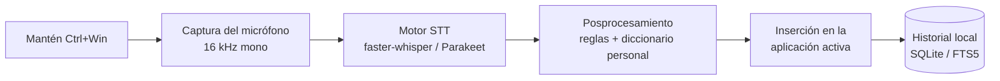

<p align="center"><a href="README.md">English</a> · <a href="README.pt-BR.md">Português (Brasil)</a> · <strong>Español</strong></p>

<div align="center">


# WZed

**Dictado de voz 100 % local para Windows.**
Mantén pulsado un atajo, habla y suéltalo: tus palabras aparecen puntuadas en el campo activo de
cualquier aplicación. Tu voz nunca sale del equipo.

[](#requisitos)
[](#requisitos)
[](#privacidad)
[](#requisitos)
[](LICENSE)

</div>

---

## Qué es

**WZed** es una alternativa privada a herramientas de dictado en la nube como Wispr Flow. No
necesita cuenta, no sube archivos y no recopila telemetría: el modelo de reconocimiento de voz se
ejecuta en tu propia GPU. Mantén pulsadas **Ctrl + Win**, habla y suelta las teclas. El texto
transcrito se inserta directamente en la aplicación que tenga el foco —editor, navegador, chat o
terminal— con puntuación y mayúsculas automáticas.

<div align="center">

| Grabando | Transcribiendo |
| :---: | :---: |
|  |  |
| Una cápsula en la parte inferior de la pantalla reacciona al micrófono. | Se vuelve azul mientras el modelo transcribe. |

</div>

## Características destacadas

- **Privado desde el diseño** — el audio se captura, transcribe y descarta localmente. No se envía nada.
- **Funciona en cualquier aplicación** — inserta texto en la ventana activa sin integraciones específicas.
- **Rápido** — latencia mediana de unos 350–500 ms con una RTX 3070 Ti; consulta [Benchmarks](#benchmarks).
- **Texto puntuado** — el modelo produce frases completas con comas, puntos y mayúsculas.
- **Idioma fijado** — el motor predeterminado (`fwhisper`) respeta el idioma configurado y no confunde portugués con inglés.
- **Diccionario personal** — corrige errores recurrentes y fuerza la grafía exacta de nombres y términos técnicos.
- **Vive en la bandeja** — se inicia con Windows sin terminal ni ventanas que interrumpan el trabajo.
- **Compatible con antivirus** — se ejecuta mediante `pythonw.exe`, firmado por la PSF, para evitar bloqueos de reputación frecuentes en `.exe` no firmados con hooks de teclado.

## Cómo funciona



El hook de *push-to-talk* se ejecuta en su propio hilo. El HUD de grabación es una superposición que
no recibe clics y desaparece **antes** de insertar el texto, por lo que las pulsaciones llegan a la
aplicación de destino y nunca a la superposición.

## Requisitos

- **Windows 10 u 11**;
- **GPU NVIDIA con CUDA**; existe un modo alternativo por CPU, aunque es más lento;
- **Python 3.12**;
- [**uv**](https://docs.astral.sh/uv/) para gestionar dependencias.

## Instalación

Clona el repositorio y haz doble clic en **`install.bat`** —o haz clic derecho en `install.ps1` y
selecciona *Ejecutar con PowerShell*—:

```powershell
git clone https://github.com/zed-silver/wzed.git
cd wzed
.\install.bat
```

El instalador es idempotente: puedes ejecutarlo de nuevo para actualizar. Se encarga de:

1. instalar [**uv**](https://docs.astral.sh/uv/) mediante `winget`, si no está disponible;
2. crear el `.venv` e instalar todas las dependencias;
3. generar el icono de la bandeja;
4. crear accesos directos en el menú Inicio y en el arranque automático, y abrir WZed.

> La primera instalación descarga el backend de reconocimiento de voz —CUDA/PyTorch— y puede
> tardar varios minutos. En el primer inicio, el modelo necesita unos 15 segundos para cargarse antes
> de que el atajo responda.

Opciones: `-NoAutostart` evita el inicio automático con Windows; `-NoStart` impide abrir el programa
al terminar la instalación. Para eliminar los accesos directos, utiliza **`uninstall.bat`** o
`install.ps1 -Uninstall`. El repositorio y el `.venv` se conservan.

> Los accesos directos ejecutan `.venv\Scripts\pythonw.exe -m wzed`, no un `.exe` empaquetado.
> `pythonw.exe` está firmado por la Python Software Foundation, lo que reduce los bloqueos por
> reputación del antivirus. Por ese motivo, WZed no distribuye un instalador `.exe`.

### Instalación manual — avanzada

```powershell
uv sync --extra api
uv run python scripts\make_icon.py
powershell -ExecutionPolicy Bypass -File scripts\install.ps1
```

### Ejecutar desde el código fuente

```powershell
uv run python -m wzed
```

Este comando mantiene una consola con registros para desarrollo y diagnóstico.

## Uso

Mantén pulsadas **Ctrl + Win**, habla y suelta las teclas. El texto se escribe en la aplicación que
tenga el foco.

Estados del icono de la bandeja:

| Color | Estado |
| :---: | --- |
| ⚪ Gris | Inactivo |
| 🔴 Rojo | Grabando |
| 🔵 Azul | Transcribiendo |

## Configuración

La configuración se guarda en `%APPDATA%\wzed\config.toml` y se crea en la primera ejecución.
Opciones principales:

```toml
[hotkeys]
push_to_talk = "<ctrl>+<win>"     # mantener pulsado para grabar

[stt]
engine = "fwhisper"               # fwhisper, idioma fijo | parakeet, detección automática
device = "cuda"                   # cuda | cpu
language = "pt"                   # idioma forzado por fwhisper
```

- **`engine`** — `fwhisper`, basado en faster-whisper `large-v3-turbo`, respeta `language` y no
  intenta adivinar el idioma. `parakeet`, NVIDIA Parakeet-TDT, es algo más rápido, pero detecta el
  idioma automáticamente e ignora `language`.
- **`show_hud = false`** oculta la cápsula de grabación en pantalla.

### Diccionario personal

Crea o edita `%APPDATA%\wzed\dictionary.txt`, con una regla por línea:

```text
# corregir una transcripción recurrente
incorrecto -> correcto
# forzar una grafía exacta
NombreDeMarca
```

Ábrelo desde el menú de la bandeja con **Abrir dicionário** (la primera vez se crea con una plantilla). Basta con guardar el archivo: los cambios se aplican en el siguiente dictado, sin reiniciar. Las reglas solo coinciden con palabras/frases completas, sin distinguir mayúsculas, y las frases más largas ganan a las más cortas. El historial guarda el texto bruto del STT y el texto final de cada dictado, para ver qué corrigió el diccionario.

El historial de dictados se almacena en una base SQLite local con búsqueda de texto completo. Los
registros se guardan en `%APPDATA%\wzed\wzed.log`.

## Benchmarks

Voces SAPI sintéticas, frases de aproximadamente cinco segundos, RTX 3070 Ti:

| Motor | WER en portugués | WER en inglés | Latencia mediana |
| --- | :---: | :---: | :---: |
| Parakeet-TDT-0.6B-v3, CUDA | 0,087 | 0,121 | **348 ms** |
| faster-whisper large-v3-turbo int8, CUDA | 0,089 | 0,121 | 497 ms |

`fwhisper` es el motor predeterminado: ofrece una precisión prácticamente idéntica, tarda unos
150 ms más y, sobre todo, no detecta el idioma de forma incorrecta.

## Antivirus — Norton, Defender y otros

Todas las herramientas de dictado con atajo global instalan un hook de teclado, un comportamiento
que puede parecer un *keylogger* para las heurísticas del antivirus. WZed adopta dos medidas:

1. se ejecuta mediante el `pythonw.exe` firmado, reduciendo las detecciones basadas en reputación;
2. si el análisis de comportamiento todavía lo bloquea, permite la carpeta del repositorio en el antivirus.

En Norton: **Configuración → Antivirus → Análisis y riesgos → Exclusiones/Riesgos bajos → Configurar
→ Añadir carpetas**. El código es abierto, se ejecuta localmente y no envía datos.

## Estructura del proyecto

```text
install.bat          # instalador de un clic
uninstall.bat        # elimina los accesos directos
install.ps1          # lógica de instalación: uv, venv, icono y accesos directos
src/wzed/
  app.py             # orquestación y bandeja del sistema
  audio/capture.py   # captura del micrófono
  stt/engines.py     # motores faster-whisper y Parakeet
  postproc/rules.py  # reglas y diccionario personal
  inject/injector.py # inserción mediante portapapeles o SendInput
  hotkeys/manager.py # hook global de push-to-talk
  history/store.py   # historial SQLite con FTS5
  ui/hud.py          # superposición de grabación
scripts/             # instalación, icono, benchmarks y pruebas rápidas
tests/               # pruebas unitarias
```

## Desarrollo

```powershell
uv sync --extra api
uv run pytest
uv run python scripts\bench_stt.py --engine both --device cuda
uv run python scripts\test_hud.py
```

## Privacidad

WZed no realiza llamadas de red durante el uso. Los modelos de voz se descargan una sola vez desde
Hugging Face y después se ejecutan íntegramente en el equipo. El audio, las transcripciones y el
historial permanecen locales.

## Licencia

[MIT](LICENSE) © zed-silver
