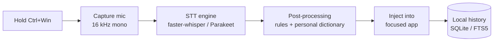

<div align="center">


# wzed

**100% local voice dictation for Windows.**
Hold a hotkey, speak, release — your words land in the active field of any app, punctuated. Your voice never leaves the machine.

[](#requirements)
[](#requirements)
[](#privacy)
[](#requirements)
[](LICENSE)

</div>

---

## What it is

**wzed** is a private alternative to cloud dictation tools like Wispr Flow. There is no account, no upload, no telemetry: the speech-to-text model runs on your own GPU. Hold **Ctrl + Win**, talk, let go — the transcribed text is typed straight into whatever app has focus (editor, browser, chat, terminal), with automatic punctuation and capitalization.

<div align="center">

| Recording | Transcribing |
| :---: | :---: |
|  |  |
| A pill on the bottom of the screen reacts to your mic. | It turns blue while the model transcribes. |

</div>

## Highlights

- **Private by design** — audio is captured, transcribed, and discarded locally. Nothing is sent anywhere.
- **Works in any app** — text is injected into the focused window; no per-app integration needed.
- **Fast** — median latency around 350–500 ms on an RTX 3070 Ti (see [Benchmarks](#benchmarks)).
- **Punctuated output** — the model writes full sentences with commas, periods, and capitals.
- **Language-locked** — the default engine (`fwhisper`) is pinned to a language, so Portuguese stays Portuguese and is never mis-detected as English.
- **Personal dictionary** — fix recurring mistakes or force exact spellings of names and jargon.
- **Lives in the tray** — starts with Windows, no terminal, no window in the way.
- **Antivirus-friendly** — runs through the PSF-signed `pythonw.exe`, avoiding the reputation blocks that hit unsigned keyboard-hook `.exe`s.

## How it works



The push-to-talk hook runs on its own thread; the recording HUD is a click-through overlay that disappears *before* the text is injected, so keystrokes always land in your target app and never in the overlay.

## Requirements

- **Windows 10 / 11**
- **NVIDIA GPU with CUDA** (a CPU fallback works but is slower)
- **Python 3.12**
- [**uv**](https://docs.astral.sh/uv/) for dependency management

## Installation

Install as a real app (Start Menu entry + starts with Windows):

```powershell
uv sync --extra dev --extra api          # installs the package into .venv
uv run python scripts\make_icon.py       # generates the tray icon
powershell -ExecutionPolicy Bypass -File scripts\install.ps1   # Start Menu + autostart shortcuts
```

After that, launch **wzed** from the Start Menu (search "wzed"); it also starts on every login and lives in the system tray.

Remove the shortcuts with `scripts\install.ps1 -Uninstall` (keep it installed but disable autostart with `-NoAutostart`).

> The shortcuts point at `.venv\Scripts\pythonw.exe -m wzed` — not a bundled `.exe`. `pythonw.exe` is **signed by the Python Software Foundation**, which avoids antivirus reputation blocks.

### Run from source (dev)

```powershell
uv run wzed-console        # with a console and logs in the terminal
```

## Usage

Hold **Ctrl + Win**, speak, release. The text is typed into the app in focus.

Tray icon states:

| Color | Meaning |
| :---: | --- |
| ⚪ Gray | Idle |
| 🔴 Red | Recording |
| 🔵 Blue | Transcribing |

## Configuration

Config lives at `%APPDATA%\wzed\config.toml` and is created on first run. Key options:

```toml
[hotkeys]
push_to_talk = "<ctrl>+<win>"     # hold to record

[stt]
engine = "fwhisper"               # fwhisper (language-locked) | parakeet (auto-detects)
device = "cuda"                   # cuda | cpu
language = "pt"                   # forced language for the fwhisper engine
```

- **`engine`** — `fwhisper` (faster-whisper `large-v3-turbo`) honors `language` and never guesses the wrong one. `parakeet` (NVIDIA Parakeet-TDT) is a touch faster but auto-detects the language and ignores `language`.
- **`show_hud = false`** hides the on-screen recording pill.

### Personal dictionary

`%APPDATA%\wzed\dictionary.txt`, one rule per line:

```
# fix a recurring mistranscription
wrong -> right
# force an exact spelling
BrandName
```

Reload it from the tray menu ("Reload dictionary") without restarting.

Dictation history is kept in a local SQLite database (full-text searchable); logs are in `%APPDATA%\wzed\wzed.log`.

## Benchmarks

Synthetic SAPI voices, ~5 s phrases, RTX 3070 Ti:

| Engine | WER (pt) | WER (en) | Median latency |
| --- | :---: | :---: | :---: |
| Parakeet-TDT-0.6B-v3 (CUDA) | 0.087 | 0.121 | **348 ms** |
| faster-whisper large-v3-turbo int8 (CUDA) | 0.089 | 0.121 | 497 ms |

`fwhisper` is the default: near-identical accuracy, ~150 ms slower, and — crucially — it never mis-detects the language.

## Antivirus (Norton / Defender / etc.)

Every dictation tool with a global hotkey installs a keyboard hook, which looks like a keylogger to antivirus heuristics. Two mitigations:

1. Running through the signed `pythonw.exe` (done) clears **file-reputation** detection.
2. If behavior-based scanning still blocks it, add a folder exclusion for the repo. In Norton: **Settings → Antivirus → Scans and Risks → Exclusions/Low Risks → Configure → Add Folders**. It is legitimate: the software is local, open, and sends nothing out.

## Project layout

```
src/wzed/
  app.py            # orchestrator + system tray
  audio/capture.py  # microphone capture
  stt/engines.py    # faster-whisper + Parakeet engines
  postproc/rules.py # rules + personal dictionary
  inject/injector.py# clipboard / SendInput text injection
  hotkeys/manager.py# global push-to-talk hook
  history/store.py  # SQLite history (FTS5)
  ui/hud.py         # recording overlay
scripts/            # install, icon, benchmarks, smoke tests
tests/              # unit tests
```

## Development

```powershell
uv sync --extra dev --extra api
uv run pytest                                                    # unit tests
uv run python scripts\bench_stt.py --engine both --device cuda   # A/B benchmark
uv run python scripts\test_hud.py                                # HUD smoke test
```

## Privacy

wzed makes no network calls at runtime. Speech models are downloaded once (from Hugging Face) and then run entirely offline on your machine. Audio, transcripts, and history stay local.

## License

[MIT](LICENSE) © zed-silver
