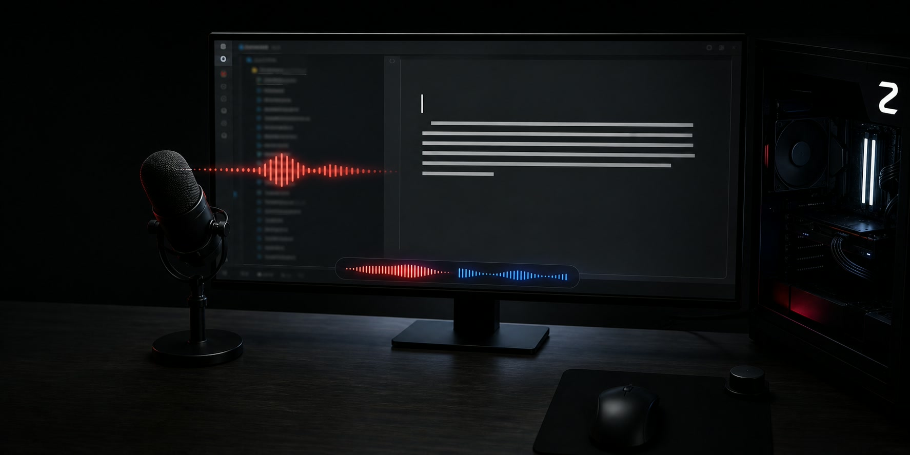
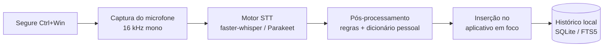

<p align="center"><a href="README.md">English</a> · <strong>Português (Brasil)</strong> · <a href="README.es.md">Español</a></p>

<div align="center">


# WZed

**Ditado por voz 100% local para Windows.**
Segure um atalho, fale e solte: suas palavras aparecem pontuadas no campo ativo de qualquer
aplicativo. Sua voz nunca sai do computador.

[](#requisitos)
[](#requisitos)
[](#privacidade)
[](#requisitos)
[](LICENSE)

</div>

---

## O que é

O **WZed** é uma alternativa privada a ferramentas de ditado em nuvem como o Wispr Flow. Não há
conta, upload nem telemetria: o modelo de reconhecimento de voz roda na sua própria GPU. Segure
**Ctrl + Win**, fale e solte. O texto transcrito é inserido diretamente no aplicativo que estiver
em foco — editor, navegador, chat ou terminal — com pontuação e letras maiúsculas automáticas.

<div align="center">

| Gravando | Transcrevendo |
| :---: | :---: |
|  |  |
| Uma cápsula na parte inferior da tela reage ao microfone. | Ela fica azul enquanto o modelo transcreve. |

</div>

## Destaques

- **Privado por projeto** — o áudio é capturado, transcrito e descartado localmente. Nada é enviado.
- **Funciona em qualquer aplicativo** — o texto é inserido na janela em foco, sem integração específica.
- **Rápido** — latência mediana de cerca de 350–500 ms em uma RTX 3070 Ti; veja [Benchmarks](#benchmarks).
- **Saída pontuada** — o modelo produz frases completas, com vírgulas, pontos e letras maiúsculas.
- **Idioma fixado** — o motor padrão (`fwhisper`) respeita o idioma configurado; português não é confundido com inglês.
- **Dicionário pessoal** — corrija erros recorrentes e force a grafia exata de nomes e termos técnicos.
- **Fica na bandeja** — inicia com o Windows, sem terminal ou janela atrapalhando o trabalho.
- **Compatível com antivírus** — usa o `pythonw.exe` assinado pela PSF, evitando bloqueios de reputação comuns em `.exe` não assinados com hooks de teclado.

## Como funciona



O hook de *push-to-talk* roda em sua própria thread. O HUD de gravação é uma sobreposição que não
recebe cliques e desaparece **antes** da inserção do texto, garantindo que as teclas cheguem ao
aplicativo de destino — nunca à sobreposição.

## Requisitos

- **Windows 10 ou 11**;
- **GPU NVIDIA com CUDA**; existe fallback para CPU, porém mais lento;
- **Python 3.12**;
- [**uv**](https://docs.astral.sh/uv/) para gerenciar dependências.

## Instalação

Clone o repositório e dê dois cliques em **`install.bat`** — ou clique com o botão direito em
`install.ps1` e escolha *Executar com PowerShell*:

```powershell
git clone https://github.com/zed-silver/wzed.git
cd wzed
.\install.bat
```

O instalador é idempotente: você pode executá-lo novamente para atualizar. Ele:

1. instala o [**uv**](https://docs.astral.sh/uv/) via `winget`, caso necessário;
2. cria o `.venv` e instala todas as dependências;
3. gera o ícone da bandeja;
4. cria atalhos no menu Iniciar e na inicialização automática e abre o WZed.

> Na primeira instalação, o backend de reconhecimento de voz — CUDA/PyTorch — é baixado e o
> processo pode levar alguns minutos. Na primeira abertura, o modelo leva cerca de 15 segundos para
> carregar antes de o atalho responder.

Opções: `-NoAutostart` impede o início automático com o Windows; `-NoStart` evita abrir o programa
ao fim da instalação. Para remover os atalhos, use **`uninstall.bat`** ou `install.ps1 -Uninstall`.
O repositório e o `.venv` são preservados.

> Os atalhos executam `.venv\Scripts\pythonw.exe -m wzed`, e não um `.exe` empacotado. O
> `pythonw.exe` é assinado pela Python Software Foundation, reduzindo bloqueios por reputação do
> antivírus. Por isso, o WZed não distribui um instalador `.exe`.

### Instalação manual — avançada

```powershell
uv sync --extra api
uv run python scripts\make_icon.py
powershell -ExecutionPolicy Bypass -File scripts\install.ps1
```

### Executar a partir do código-fonte

```powershell
uv run python -m wzed
```

Esse comando mantém um console com os logs para desenvolvimento e diagnóstico.

## Uso

Segure **Ctrl + Win**, fale e solte. O texto será digitado no aplicativo em foco.

Estados do ícone na bandeja:

| Cor | Estado |
| :---: | --- |
| ⚪ Cinza | Ocioso |
| 🔴 Vermelho | Gravando |
| 🔵 Azul | Transcrevendo |

## Configuração

A configuração fica em `%APPDATA%\wzed\config.toml` e é criada na primeira execução. Principais
opções:

```toml
[hotkeys]
push_to_talk = "<ctrl>+<win>"     # segure para gravar

[stt]
engine = "fwhisper"               # fwhisper, com idioma fixo | parakeet, com detecção automática
device = "cuda"                   # cuda | cpu
language = "pt"                   # idioma forçado pelo fwhisper
```

- **`engine`** — `fwhisper`, baseado em faster-whisper `large-v3-turbo`, respeita `language` e não
  tenta adivinhar o idioma. `parakeet`, NVIDIA Parakeet-TDT, é um pouco mais rápido, mas detecta o
  idioma automaticamente e ignora `language`.
- **`show_hud = false`** oculta a cápsula de gravação na tela.

### Dicionário pessoal

Crie ou edite `%APPDATA%\wzed\dictionary.txt`, com uma regra por linha:

```text
# corrigir uma transcrição recorrente
errado -> correto
# forçar uma grafia exata
NomeDaMarca
```

Abra pelo menu da bandeja em **Abrir dicionário** (na primeira vez ele é criado com um modelo). Basta salvar o arquivo: a mudança vale a partir do próximo ditado, sem reiniciar. As regras só casam palavras/frases inteiras, sem diferenciar maiúsculas, e frases mais longas vencem as mais curtas. O histórico guarda o texto bruto do STT e o texto final de cada ditado, para você ver o que o dicionário corrigiu.

O histórico de ditados fica em um banco SQLite local pesquisável por texto completo. Os logs ficam
em `%APPDATA%\wzed\wzed.log`.

## Benchmarks

Vozes SAPI sintéticas, frases de aproximadamente cinco segundos, RTX 3070 Ti:

| Motor | WER em português | WER em inglês | Latência mediana |
| --- | :---: | :---: | :---: |
| Parakeet-TDT-0.6B-v3, CUDA | 0,087 | 0,121 | **348 ms** |
| faster-whisper large-v3-turbo int8, CUDA | 0,089 | 0,121 | 497 ms |

O `fwhisper` é o padrão: tem precisão praticamente igual, é cerca de 150 ms mais lento e, sobretudo,
não detecta o idioma incorretamente.

## Antivírus — Norton, Defender e outros

Toda ferramenta de ditado com atalho global instala um hook de teclado, comportamento que pode
parecer um *keylogger* para heurísticas de antivírus. O WZed adota duas medidas:

1. executa pelo `pythonw.exe` assinado, reduzindo detecções baseadas em reputação do arquivo;
2. se a análise comportamental ainda bloquear o programa, permita a pasta do repositório no antivírus.

No Norton: **Configurações → Antivírus → Verificações e riscos → Exclusões/Baixos riscos →
Configurar → Adicionar pastas**. O código é aberto, roda localmente e não envia dados.

## Estrutura do projeto

```text
install.bat          # instalador de um clique
uninstall.bat        # remove os atalhos
install.ps1          # lógica de instalação: uv, venv, ícone e atalhos
src/wzed/
  app.py             # orquestração e bandeja do sistema
  audio/capture.py   # captura do microfone
  stt/engines.py     # motores faster-whisper e Parakeet
  postproc/rules.py  # regras e dicionário pessoal
  inject/injector.py # inserção via clipboard ou SendInput
  hotkeys/manager.py # hook global de push-to-talk
  history/store.py   # histórico SQLite com FTS5
  ui/hud.py          # sobreposição de gravação
scripts/             # instalação, ícone, benchmarks e testes rápidos
tests/               # testes unitários
```

## Desenvolvimento

```powershell
uv sync --extra api
uv run pytest
uv run python scripts\bench_stt.py --engine both --device cuda
uv run python scripts\test_hud.py
```

## Privacidade

O WZed não faz chamadas de rede durante o uso. Os modelos de voz são baixados uma única vez do
Hugging Face e, depois disso, executados inteiramente na máquina. Áudio, transcrições e histórico
permanecem locais.

## Licença

[MIT](LICENSE) © zed-silver
